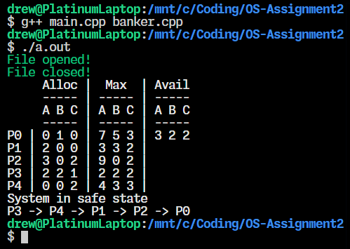
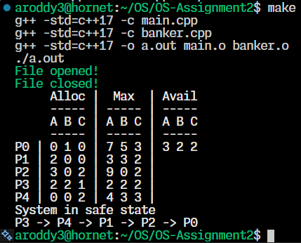

# Operating Systems Assignment 2

# **Usage Instructions**
Run on a Linux or Unix system. 
Run using these commands.
```cpp
g++ main.cpp banker.cpp
./a.out
```
This also uses the GNU C++ Compiler for `g++` using C++17 or later.

As a `Makefile` is included the user can use `make` to run the program and `make clean` to clean up the binaries after running the program.
```
make
make clean
```

### Input File Format - `input-file.txt`
```
---allocation
0, 1, 0,
2, 0, 0,
3, 0, 2,
2, 2, 1,
0, 0, 2,
---max
7, 5, 3,
3, 3, 2,
9, 0, 2,
2, 2, 2,
4, 3, 3,
---available
3, 2, 2,
```
This is a very strict input file format. Only the integer values can be modified as everything else must stay the same. The user must guarantee this format is followed.
The `---` explain what type of value is below for easy understanding from just looking at the input file
# Program Description

### Bankers Algorithm
The system is in a safe state. The safe sequence is P3 -> P4 -> P1 -> P2 -> P0.

The bankers algorithm can be used by operating systems to avoid deadlock. The algorithm keeps track of the available resources in the system and allocates them to make sure the system does not run out of resources an enter deadlock. It makes sure that the system never leaves a safe state by granting resources. It makes sure there is at least one execution order so all processes can finish without entering deadlock.

It first calculates the need matrix by subtracting the allocation matrix from the max matrix. It then looks for a process that hasn't been tested yet and checks if the need is less than or equal to the currently available. If need is less than or equal to available then it adds the allocation to the available. It keeps repeating this until either no more processes can be selected and deadlock is possible or all processes are in a safe sequence. If all processes are in a safe sequence then it can return true.

### Make File - `Makefile`
```Makefile
COMPILER = g++
COMPILERFLAGS = -std=c++17
```
Chooses the compiler and the standard of C++ to run. Here it chooses C++17.

```
TARGETS = a.out
```
Chooses the target file that the final executable will be named.
Here I chose `a.out` as the final file name.

```
# SETUP
all: run
```
Decides what will be run when the uses types `make`

```
run: $(TARGETS)
	./a.out
```
The run command will do `./a.out`

```
$(TARGETS): main.o banker.o
	$(COMPILER) $(COMPILERFLAGS) -o a.out main.o banker.o
```
Links the object files together. These files are `main.o` and `banker.o`. These are what is links to `a.out`.

```
main.o: main.cpp
	$(COMPILER) $(COMPILERFLAGS) -c main.cpp

banker.o: banker.cpp
	$(COMPILER) $(COMPILERFLAGS) -c banker.cpp
```
Compiles the `main.o` file and the `banker.o` file together.

```
clean:
	rm -f *.o $(TARGETS)
```
Here it removes all `.o` files and the selected `a.out` file to clean the system.
This can be run by doing `make clean` in the terminal.

### Banker Header File - `banker.hpp`
```cpp
#ifndef BANKER_HPP_
#define BANKER_HPP_

#include <iostream>
#include <fstream>
#include <string>
#include <vector>
```
This includes all of the headers that the program will be using.
It uses:
`iostream` for output to the terminal
`fstream` for the ability to read and write to files
`string` to use `std::string` and features of strings
`vector` for `std::vector` and `.push_back()` for the vectors

```cpp
using std::vector;
```
This allows for the user of `std::vector` without the `std::`

```cpp
class Banker {
```
Begins the `Banker` class. This class is where all variables and functions for this project are stored.

```cpp
public:
    Banker(std::string file) { 
        openFile(file); // Opens the file
        parseFile();    // Gets the variables
        getNeed();      // Finds the need
        safeState_ ={}; // Makes sure safe state is empty
        closeFile();    // Closes the file
    }
```
The constructor opens the file, then parses it which gets the data from the file and assigns it to private variables. Then it finds the need for each process. Then it initializes the safe state variable to empty. After that it closes the file as it is done using it.

```cpp
    void print() const;
    bool bankersAlgorithm();

    void openFile(const std::string& fileName);
    void parseFile();
    void getNeed();
    void closeFile();
    
    bool allocatable(int, vector<int>&) const;
```
Here the program declares a lot of member functions.
These functions will all be explained later.
```cpp
    vector<int> getSafeState() {
        if (safeState_.empty()) { bankersAlgorithm(); }
        return safeState_;
    }
```
This function checks if the user has already run and created the safe state vector. If it has not it runs the bankers algorithm function.
It then returns the correct safe state vector.

```cpp
private:

    vector<vector<int>> allocation_;
    vector<vector<int>> max_;
    vector<vector<int>> need_;

    vector<int> available_;
    vector<int> safeState_;

    std::ifstream file_;
};
```
These are the member variables used in the program.

```cpp
#endif
```
This ends the `#ifndef` statement to define everything needed in the header file.

### Banker C++ File - `banker.cpp`
```cpp
#include "banker.hpp"
```
The program includes the header file which allows the use of the class I already defined.

```cpp
void Banker::openFile(const std::string& fileName) {
    // Opens the file
    file_.open(fileName);
```
This opens the file using the `fstream` library.

```cpp
    // Makes sure the file opened properly
    if (!file_.is_open()) {
        std::cout << "\033[31m"; // Makes the text red
        std::cout << "ERROR : File is not opening." << std::endl;
    } else {
        std::cout << "\033[32m"; // Makes th text green
        std::cout << "File opened!" << std::endl;
    }
    std::cout << "\033[37m"; // Reset text color back to white
}
```
The function then checks if the file is open. If the file is not open it prints an error message in red. If the file is open it prints `File opened!` in green.

```cpp
void Banker::closeFile() {
    if (file_.is_open()) {
        file_.close();
        std::cout << "\033[32m"; // Makes th text green
        std::cout << "File closed!" << std::endl;
        std::cout << "\033[37m"; // Reset text color back to white
    }
}
```
This function closes the file if it is open. Then it reports back that the file closed if it was open.

```cpp
void Banker::parseFile() {

    // Parse Mode
    enum class PM { none, allocation, max, available };
    PM mode = PM::none;
```
This creates an enumerated class that contains the states that parsing our file can be in. 
It sets it to none to start out with.

```cpp
    std::string line;
    while (std::getline(file_, line)) {
        if (line.empty()) continue;
```
This allows the program to iterate through all lines and sets each line in the file to a string of variable name `line`.

```cpp
        // Change the mode if necessary
        if (line.find("---") != std::string::npos) { 
```
The input file is formatted in a way where each different group is titled with three dashes at the beginning. This if statement detects if the program is going to experience a mode change.

```cpp
            // Sets the mode based on line
            if (line.find("allocation") != std::string::npos) {
                mode = PM::allocation;
            } else if (line.find("max") != std::string::npos) {
                mode = PM::max;
            } else if (line.find("available") != std::string::npos) {
                mode = PM::available;
            }
```
Based on the text in the line the program will switch what mode the program is in and using.

```cpp
        } else {
            // Sets the vector based on the mode

            // Makes the vector
            // Subtracts 48 to make it a proper number
            vector<int> vec = {
                line[0] - 48,
                line[3] - 48,
                line[6] - 48
            };
```
If the file is not a mode switch then get the three numbers that are separated by the commas. This creates a vector of those numbers.

```cpp
            // Based on the mode add to the vector
            if (mode == PM::allocation) allocation_.push_back(vec);
            if (mode == PM::max)        max_.push_back(vec);
            if (mode == PM::available)  available_ = vec;
        }
```
After getting the three numbers then input those numbers into their respective vector.
For the available vector it just sets the gotten vector to the variable.

```cpp
    }
}
```
These end off the original while statement and the function as a whole.

```cpp
void Banker::print() const {
```
This print function prints out all of the information that the program got from parsing the file. it never accesses the file . It just prints the file information.

```cpp
    std::cout << "     Alloc |  Max  | Avail" << std::endl;
    std::cout << "     ----- | ----- | -----" << std::endl;
    std::cout << "     A B C | A B C | A B C" << std::endl;
    std::cout << "     ----- | ----- | -----" << std::endl;
```
This print function prints out the header of the table.

```cpp
    for (int y=0; y<allocation_.size(); ++y) {
        std::cout << "P" << y << " | ";
```
This iterates through every process printing information for each.

```cpp
        // Prints off allocation
        for (int x=0; x<3; ++x) {
            std::cout << allocation_[y][x] << " ";
        }
```
This prints all of the allocation information separated by spaces.

```cpp
        std::cout << "| "; // Spacing
```
This places spaces and bars in  between the table columns.

```cpp
        // Prints off Max row
        for (int x=0; x<3; ++x) {
            std::cout << max_[y][x] << " ";
        }
```
This prints off all of the values in the max vector

```cpp
        std::cout << "| "; // Spacing
```
This puts spacing and a bar in between each different type of value.

```cpp
        // There is only one line for available
        if (y==0) {
            for (int x=0; x<3; ++x) {
                std::cout << available_[x] << " " ;
            }
        };
        std::cout << std::endl;
```
This makes sure that only the first row of values is printed for the `available_` vector as unlike the other two 2D vectors this one only has one row.

```cpp
    }
}
```
This closes out the for loop used to print off each column and closes out the print function as a whole.

```cpp
void Banker::getNeed() { 
```
This function calculates the need 2D vector and stores it in the `need_` variable.

```cpp
    // Iterates through all values in allocation and max
    for (int y=0; y<allocation_.size(); ++y) {
        vector<int> processNeed; // Row
        for (int x=0; x<allocation_[y].size(); ++x) {
```
This iterates through every value in `allocation_`.

```cpp
            // Get new need value
            int newNeed = max_[y][x] - allocation_[y][x];
    ```
This subtracts every value of `allocation_` from every value of  `max_`.
```cpp
            // Add value the row
            processNeed.push_back(newNeed);
        }
```
This then stores them in `processNeed` which is a vector of integers.

```cpp
        // Add row to list
        need_.push_back(processNeed);
```
The vector of integers is then pushed into the 2D vector of `need_`.

```cpp
    }
}
```
This closes off the get need function and the larger for loop.

```cpp
bool Banker::allocatable(int rowIndex, vector<int>& nowAvailable) const {
    // If need is ever greater than now available cannot allocate
    for (int x=0; x<nowAvailable.size(); ++x) {
        if (need_[rowIndex][x] > nowAvailable[x]) { return false; }
    }
    return true; // If need is never greater than now available
}
```
This function calculates if the memory is allocatable. It returns false if need is greater than the available memory. It returns true otherwise.

```cpp
bool Banker::bankersAlgorithm() { 
```
This function runs the bankers algorithm and returns true if the processes memory is able to be allocated in a safe way. It returns false otherwise.

```cpp
    safeState_.clear(); // Makes sure safe state is empty
```
This clears out the safe state vector to make sure it is empty before proceeding.

```cpp
    int size = allocation_.size();
    // Makes sure allocation and max have same length
    if (size != max_.size()) return false;
```
This makes sure that the allocation vector size is the same as the max vector size. This makes sure both are using the same amount of processes as otherwise there would not be a way to run the bankers algorithm.

```cpp
    // Vector of if its tested or not
    vector<bool> tested(size, false);

    // Temporary copy of available_ to be edited
    vector<int> currentlyAvailable = available_;
    bool safe;
    int processesDone = 0;
```
Creates and initializes variables to be used later in the program.

```cpp
    while (processesDone < size) {
        safe = false;
        for (int x=0; x<size; ++x) {
```
This iterates as long as the amount of processes the program has completed is less than the size of the allocated vector. It then iterates through each process.

```cpp
            if (tested[x]) continue; // If process already tested then skip
```
This code is used to make sure that processes that have already been tested are no longer checked or used by the program.

```cpp
            if (allocatable(x, currentlyAvailable)) {
    ```
This checks if the process is allocatable. If it is it runs the below code.

```cpp
                // iterate through row
                for (int y=0; y<allocation_[0].size(); ++y) {
                    currentlyAvailable[y] += allocation_[x][y];
                } 
```
This iterates through the allocation vector and adds every index of memory to the currently available vector.

```cpp
                tested[x] = true;
                safe = true;

                safeState_.push_back(x);
                processesDone++;
```
Because the process is currently allocatable the program is set safe to true, tested at the current index to true, add the process to the safe state vector, and add one to the number of processes the program has completed.

```cpp
            }
        }
        if (!safe) return false;
    }
    return true;   
}
```
The final thing done in this function is returning false if the process order has no way of being safe to run and true if it does.
### Main C++ File - `main.cpp`
```cpp
#include "banker.hpp"
```
The program include the `banker` header file which allows the programmer to use all of the function that were created.

```cpp
int main() {
    
    // Opens file as the bank on run
    Banker bank("input-file.txt");
    ```
This runs the constructor which opens the file, parses the file, and closes the file. It also calculates need and initializes other variables.

```cpp
    bank.print();
    ```
The bank prints off the information that was parsed from the constructor.

```cpp
    bool safe = bank.bankersAlgorithm();
```
This function runs the bankers algorithm to detect if the processes can be run in a safe order. It then prints that result.

```cpp
    if (safe) {
        std::cout << "System in safe state" << std::endl;
        vector<int> order = bank.getSafeState();
```
If the program is safe it prints off that the system is in a safe state. It then gets the safe state order. This is the order that the processes can safely execute in.

```cpp
        for (int i=0; i < order.size(); ++i) {
            if (i!=0)std::cout << " -> ";
            std::cout << "P" << order[i];
        }
        std::cout << std::endl;
```
This prints off the proper process order.

```cpp
    } else {
        std::cout << "System NOT in safe state" << std::endl;
    }
```
If the program is not in a safe state then it prints that the program is not in a safe state.

```cpp
    return 0;
}
```
Exits gracefully.
# Examples and Results

This is a sample output of the program running.
```
File opened!
File closed!
     Alloc |  Max  | Avail
     ----- | ----- | -----
     A B C | A B C | A B C
     ----- | ----- | -----
P0 | 0 1 0 | 7 5 3 | 3 2 2
P1 | 2 0 0 | 3 3 2 |
P2 | 3 0 2 | 9 0 2 |
P3 | 2 2 1 | 2 2 2 |
P4 | 0 0 2 | 4 3 3 |
System in safe state
P3 -> P4 -> P1 -> P2 -> P0
```

This is an example of the program being run using `WSL` or Windows Subsystem for Linux which allows the use of Linux on windows machines. This is also compiled using the `g++` command.



This second example is an image of the program running on the Kent State `hornet` server. This runs the Linux system. This time the program was run using the `make` command.



At the bottom of all of these outputs is the safe state and sequence.

## Thank You
Thank you for reading this!